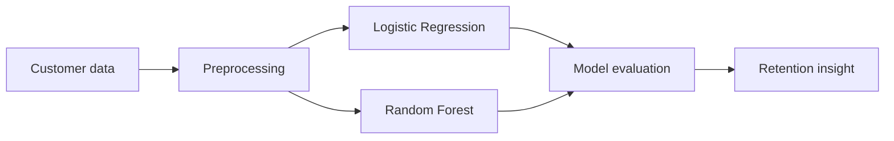
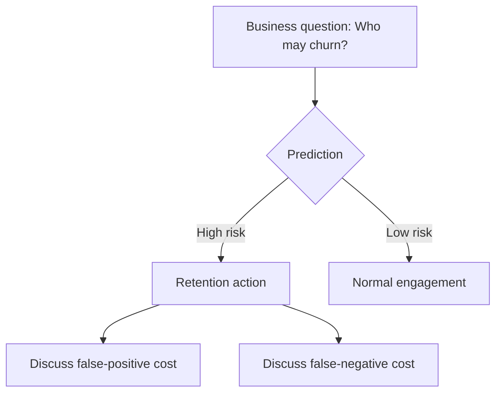

# Customer Churn Prediction — ML Demo

> A visual, reproducible classification demo for AI / data science teaching.  
> **Synthetic data · No API key · No company data**

## What this project demonstrates



### Model evaluation dashboard

| Metric | What students learn |
|---|---|
| Accuracy | Overall correctness |
| Precision | How many predicted churners really churn |
| Recall | How many actual churners we find |
| F1 | Balance of precision and recall |
| ROC-AUC | Ranking ability across thresholds |



## Teaching storyline

**Business problem → features → preprocessing → model → metrics → business decision**

This makes the project suitable for explaining why a model with high accuracy is not automatically the best business model.

## Actual result charts

The following results are generated from the repository's synthetic dataset (fixed seed = 42), not manually invented values.

### Model metrics

```mermaid
xychart-beta
    title "Model evaluation"
    x-axis ["Accuracy","Precision","Recall","F1","ROC-AUC"]
    y-axis "Score" 0 --> 1
    bar [0.749,0.646,0.436,0.520,0.788]
    bar [0.685,0.494,0.359,0.416,0.714]
```



**Series 1: Logistic Regression · Series 2: Random Forest**

| Model | Accuracy | Precision | Recall | F1 | ROC-AUC |
|---|---:|---:|---:|---:|---:|
| Logistic Regression | 0.749 | 0.646 | 0.436 | 0.520 | 0.788 |
| Random Forest | 0.685 | 0.494 | 0.359 | 0.416 | 0.714 |

The result is also useful pedagogically: a more complex model does not automatically outperform a simpler model.

## Quick start
```bash
python -m venv .venv
pip install -r requirements.txt
python src/generate_data.py
python src/train.py
```

The training script produces `model_metrics.json`, making it easy to compare models and extend the demo with charts.

## Topics I can teach with this project
Classification · feature engineering · one-hot encoding · train/test split · Logistic Regression · Random Forest · Precision/Recall/F1 · ROC-AUC · threshold tuning · model interpretation

## Privacy & security
All records are generated synthetically with a fixed random seed. No credentials, API keys, customer records or company information are used.