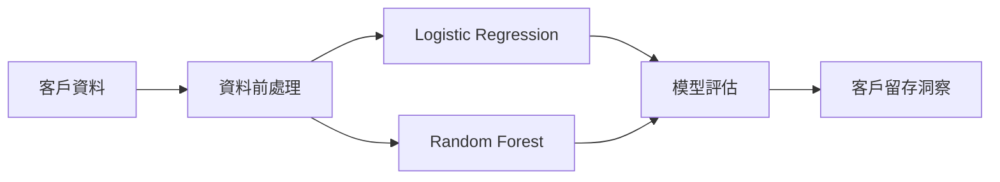

# 客戶流失預測 — 機器學習 Demo

[English](README.md) | **繁體中文**

> AI／資料科學的視覺化、可重現分類模型範例。  
> **合成資料 · 不需要 API Key · 不含公司資料**

## 專案展示內容



### 模型評估

| 指標 | 教學重點 |
|---|---|
| Accuracy | 整體預測正確率 |
| Precision | 預測為流失的客戶中，實際流失的比例 |
| Recall | 實際流失客戶中，被模型找出的比例 |
| F1 | Precision 與 Recall 的平衡 |
| ROC-AUC | 模型在不同 threshold 下的排序能力 |

## 實際執行結果

以下數值由本專案固定 random seed = 42 的合成資料實際產生。

```mermaid
xychart-beta
    title "模型評估"
    x-axis ["Accuracy","Precision","Recall","F1","ROC-AUC"]
    y-axis "Score" 0 --> 1
    bar [0.749,0.646,0.436,0.520,0.788]
    bar [0.685,0.494,0.359,0.416,0.714]
```



**第一組：Logistic Regression · 第二組：Random Forest**

| 模型 | Accuracy | Precision | Recall | F1 | ROC-AUC |
|---|---:|---:|---:|---:|---:|
| Logistic Regression | 0.749 | 0.646 | 0.436 | 0.520 | 0.788 |
| Random Forest | 0.685 | 0.494 | 0.359 | 0.416 | 0.714 |

結果：**模型越複雜，不代表效果一定越好。**

## 教學脈絡

**商業問題 → 特徵 → 資料前處理 → 模型 → 評估指標 → 商業決策**

可進一步討論 False Positive、False Negative、threshold tuning，以及不同錯誤對客戶留存策略造成的成本。

## 執行方式

```bash
python -m venv .venv
pip install -r requirements.txt
python src/generate_data.py
python src/train.py
```

## 可延伸主題

Classification · Feature Engineering · One-hot Encoding · Train/Test Split · Logistic Regression · Random Forest · Precision/Recall/F1 · ROC-AUC · Threshold Tuning · Model Interpretation

## 資料安全

所有資料皆由程式以固定 random seed 產生，不含 API Key、帳密、真實客戶資料或公司內部資訊。
